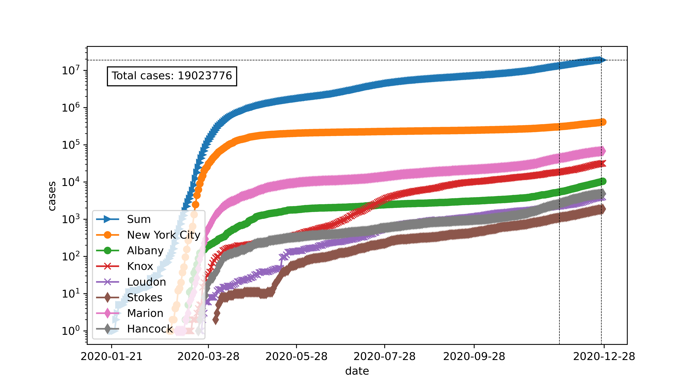

# covid-19

Tools to manipulate covid-19 data from NY Times dataset
====

The NY-Times dataset contains FIPS codes, this project contains programs to:

- Add latitude and longitude coordinates to the dataset with Python
- Plot data from specific counties

